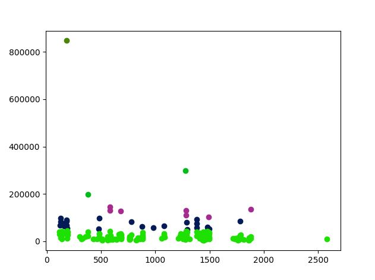

# IKEA
An implementation of machine learning algortihm k-means to help IKEA expand to the right regions

Based on the image above output is: 

Cluster 0:

 Uppsala, Malmo

Cluster 1:

 Kalmar, Karlstad, Jarfalla, Huddinge, Alvesta, Tidaholm, Askersund, Botkyrka, Staffanstorp, Haninge, Flen, Lysekil, Taby, Lessebo, Horryda, Sollentuna, Sodertalje, Nacka, Vingaker, Alvesta, Bjuv, Simrishamn, Sotenas, Mellerud, Solna, Norrtalje, Tyreso, Nykoping, Eskilstuna, Vaxjo, Gotland, Karlskrona, Kristianstad, Hassleholm, Halmstad, Varberg, Kungsbacka, Molndal, Eskilstuna, Uddevalla, Trollhattan, Skovde

Cluster 2:

 Haparanda, Upplands Vasby, Ale, Vallentuna, Trosa, Orust, Osteraker, Varmdo, Ekero, Vargorda, Salem, Bastad, Tyreso, Upplands-Bro, Hoor, Bromolla, Osby, Nykvarn, Ale, Danderyd, Sundbyberg, Lidingo, Hoganas, Vaxholm, Nybro, Tibro, Sigtuna, Nynashamn, Habo, Alvkarleby, Heby, Tierp, Vetlanda, Enkoping, Osthammar, Vingaker, Gnesta, Oxelosund, Flen, Oskarshamn, Katrineholm, Degerfors, Strangnas, Gnosjo, Trosa, Adeshog, Arvika, Ydre, Kinda, Boxholm, Atvidaberg, Finspang, Osteraker, 

 Valdemarsvik, Soderkoping, Motala, Vadstena, Mjolby, Falkoping, Aneby, Bengtsfors, Gnosjo, Mullsjo, Habo, Gislaved, Vaggeryd, Partille, Nassjo, Varnamo, Savsjo, 

 Vetlanda, Eksjo, Tranas, Uppvidinge, Lessebo, Tingsryd, Alvesta, Almhult, Markaryd, Gotland, Ljungby, Hogsby, Tingsryd, Torsas, Morbylanga, Hultsfred, Monsteras, Emmaboda, Nybro, Oskarshamn, Vastervik, Vimmerby, Borgholm, Olofstrom, Ronneby, Karlshamn, Solvesborg, Svalov, Staffanstorp, Burlov, Vellinge, Ostra Goinge, Orkelljunga, Bjuv, Kavlinge, Lomma, Svedala, Skurup, Sjobo, Horby, Hoor, Tomelilla, Bromolla, Osby, Perstorp, Klippan, Astorp, Bastad, Landskrona, Hoganas, Eslov,  

 Kristianstad, Ystad, Trelleborg, Simrishamn, Angelholm, Vaxjo, Hylte, Laholm, Falkenberg, Horryda, Partille, Ackero, Stenungsund, Tjorn, Orust, Orust, Sotenas, Munkedal, Tanum, Dals-Ed, Fargelanda, Ale, Lerum, Vargorda, Bollebygd, Grastorp, Essunga, Karlsborg, Gullspang, Tranemo, Bengtsfors, Mellerud, Lilla Edet, Mark, Svenljunga, Herrljunga, Vara, Gotene, Tibro, Osthammar, Tareboda, Kungalv, Lysekil, Stromstad, Boras, Molndal, Vanersborg, Nacka, Alingsas, Solna, Ulricehamn, Omal, Mariestad, Lidkoping, Skara, Hjo, Tidaholm, Falkoping, Kil, Eda, Torsby, Storfors, Hammaro, Munkfors, Forshaga, Grums, Arjang, Sunne, Kristinehamn, Filipstad, Hagfors, Bastad, Arvika, Saffle, Lekeberg, Laxo, Hallsberg, Degerfors, Hallefors, Ljusnarsberg, Kumla, Askersund

Cluster 3:

 Linkoping, Norrkoping, Gislaved, Jonkoping, Lund, Stromstad, Helsingborg, Boras, Orebro

Cluster 4:

 Stockholm

All the clusters shows how IKEA warehouses should be placed based on location and population. E.g Stockholm should have its own IKEA as shown in cluster 4.
